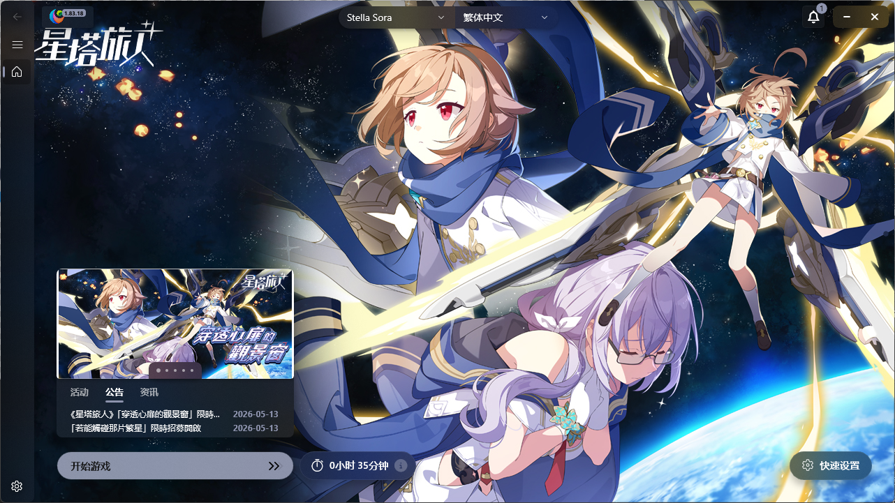

  

# Hi3Helper.Plugin.StellaSora

**English** · [简体中文](./README.zh-CN.md)

A third-party plugin developed for [Collapse Launcher](https://collapselauncher.com/), designed to support the downloading, updating, and launching of **StellaSora**.

**Plugin Status**: Currently, all basic features have been implemented. Extended features await official support and updates from Collapse.

You can download the plugin via the [Official Collapse Launcher Website](https://collapselauncher.com/plugin/catalog.html) or [My Plugin Website (Recommended)](https://cl-plugins.sakurakoi.top/).

  
  

---

> [!IMPORTANT]
> This plugin is not officially maintained by Collapse. Please do not submit issues to the official Collapse repository or official Discord.
> 
> Please prioritize submitting issues in this repository. Submitting issues through other channels will not receive immediate support!
>
> The current self-update feature is experiencing network issues. Please do not rely on auto-update for now. Instead, please manually download the latest version of the plugin; I am currently working on a solution and will implement it in the next release.

**If this plugin helped you, please give it a ⭐ to support me!**

## ✨ Features

### ✅ Currently Supported

- **Version Detection**: Automatically detects if the client version is up to date.
- **Information Retrieval**: Automatically pulls and displays official background images, banners, and the latest news/announcements.
- **Game Management**: Supports complete game downloading, installation, launching, and process detection.
- **Game Update**: Supports updating the game.
- **Multi-Server Support**:
   - [x] Mainland China
   - [x] Traditional Chinese (Taiwan)
   - [ ] South Korea
   - [ ] Japan
   - [ ] Global
- **Incremental Game Updates**: Current incremental game update is a beta feature, which may lead to update failures/errors/file corruption. Please back up game files before updating.
- **Integrity Verification**: Automatically performs integrity verification and game repair after an update.
- **Official Launcher Logic Simulation**: Mimics the logical behavior of the official launcher as closely as possible to ensure proper functionality.

### 🚧 Development Plan / ToDo

- [ ] **Pre-download Support**: Awaiting the official launcher to implement relevant interfaces.
- [ ] **Manual Integrity Check**: Collapse Launcher does not seem to provide relevant API interfaces for manual verification; awaiting upstream updates.
- [ ] **Social Media Panel**: Integrate official social media feed displays (Basic support exists, but currently disabled as icons cannot be retrieved via API).
- [ ] **Game Update**: Awaiting the official release of the next version to test whether the simulated official update logic functions correctly.

---

## 🧩 How to Install the Plugin

**Prerequisites:**
Before using this plugin, please ensure your Collapse Launcher version is `1.83.14` or higher.

### Installation Steps

1. **Download the Plugin**
   Go to the [Releases page](https://github.com/misaka10843/Hi3Helper.Plugin.Hypergryph/releases/latest) and download the latest plugin archive (`.zip` file).

   

2. **Enter Plugin Management**
   Open the launcher, go to the **Settings** page, scroll down, and click `Open Plugin Management Menu`.

   

3. **Add and Apply**
   In the pop-up window, click the `Click to add .zip or manifest.json` button and select the `.zip` file you just downloaded.

   After adding, **restart the launcher** for the changes to take effect.

   

---

## ⚠️ Disclaimer

This project is a third-party open-source plugin and is not affiliated with _Yostar_ or _stargazer_.