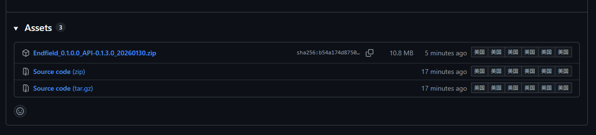
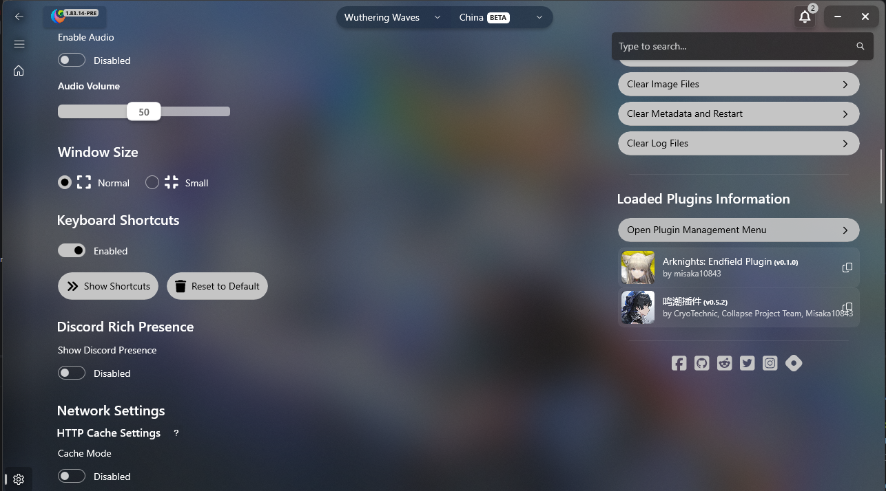
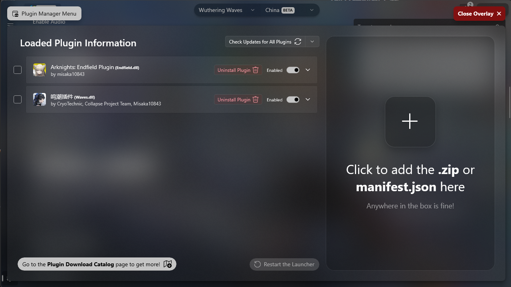

  <!---->

# Hi3Helper.Plugin.StellaSora

**English**<!-- · [简体中文](./README.zh-CN.md)-->

A third-party plugin for [Collapse Launcher](https://collapselauncher.com/), designed to support the downloading,
updating, and launching of **Stella Sora**.

The core functionality is currently ready for daily game management and launching.

<!---->

  
  

---

> [!WARNING]
> **It is highly recommended to back up your game directory before updating to prevent file corruption due to update
errors.**

## �?Features

### �?Currently Supported

> Todo

### 🚧 Roadmap / To-Do

> Todo
---

## 🧩 Installation

**Prerequisites:**
Before using this plugin, please ensure your Collapse Launcher version is `1.83.14` or higher.

### Steps

1. **Download the Plugin**
   Go to the [Releases Page](https://github.com/misaka10843/Hi3Helper.Plugin.StellaSora/releases/latest) and download
   the
   latest plugin archive (`.zip` file).

   

2. **Open Plugin Manager**
   Open the launcher, go to **Settings**, scroll down, and click on `Open Plugin Manager Menu`.

   

3. **Add and Restart**
   In the pop-up window, click the `Click to add .zip or manifest.json` button and select the `.zip` file you just
   downloaded.

   Once added, **restart the launcher** for the changes to take effect.

   

---

## ⚠️ Disclaimer

This project is a third-party open-source plugin and is not affiliated with _YoStar_.
